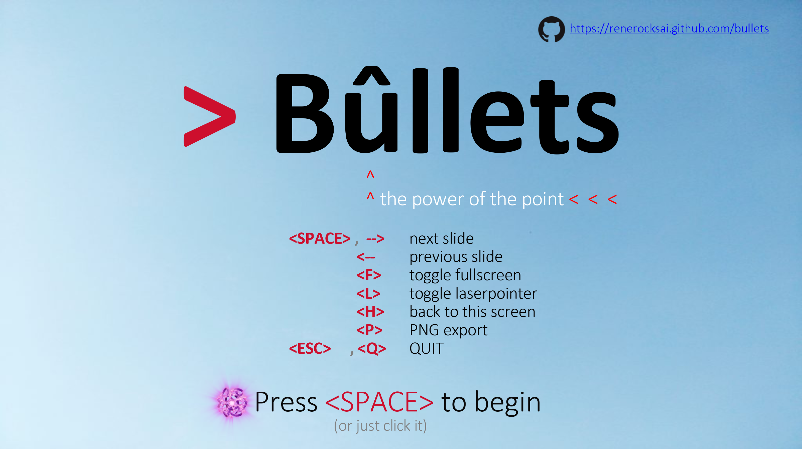
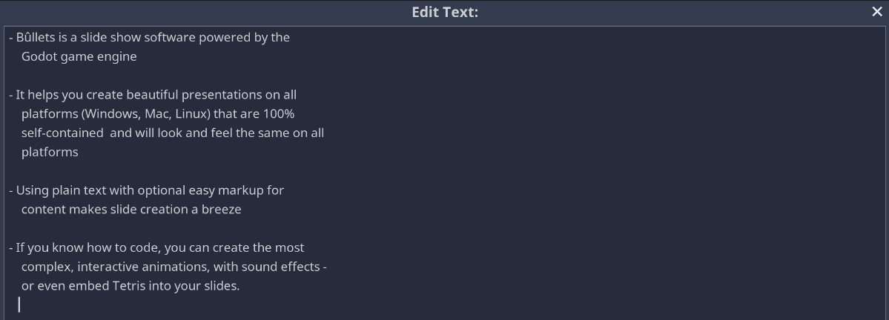
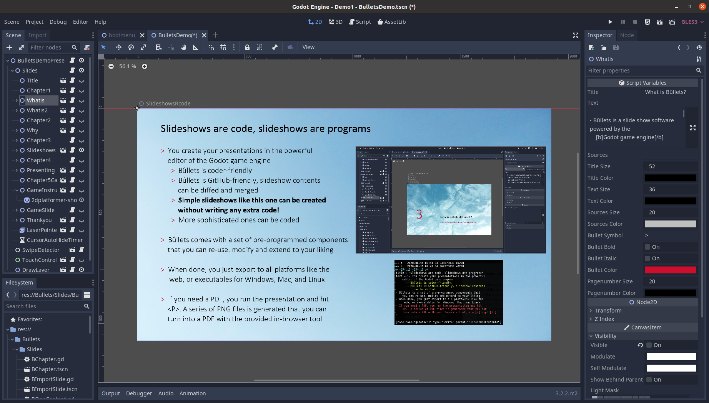
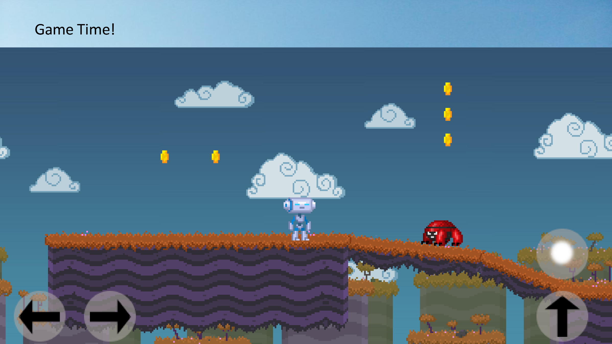
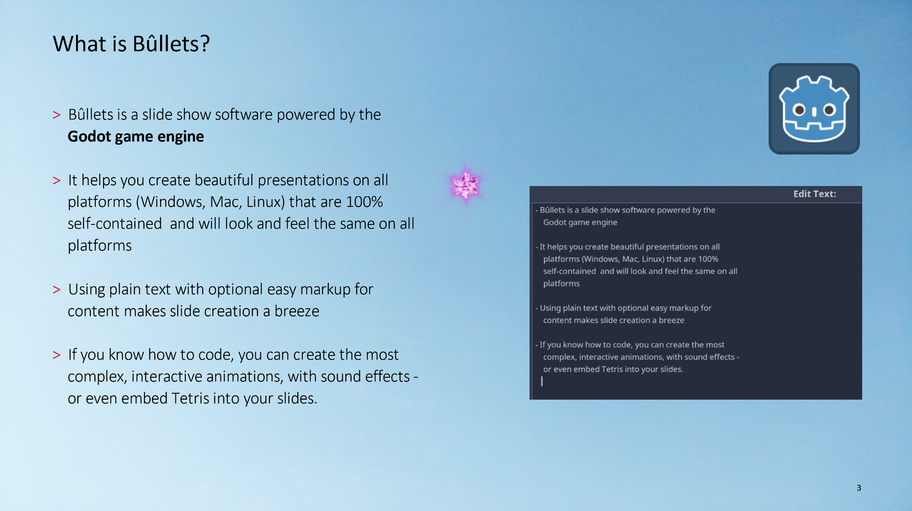
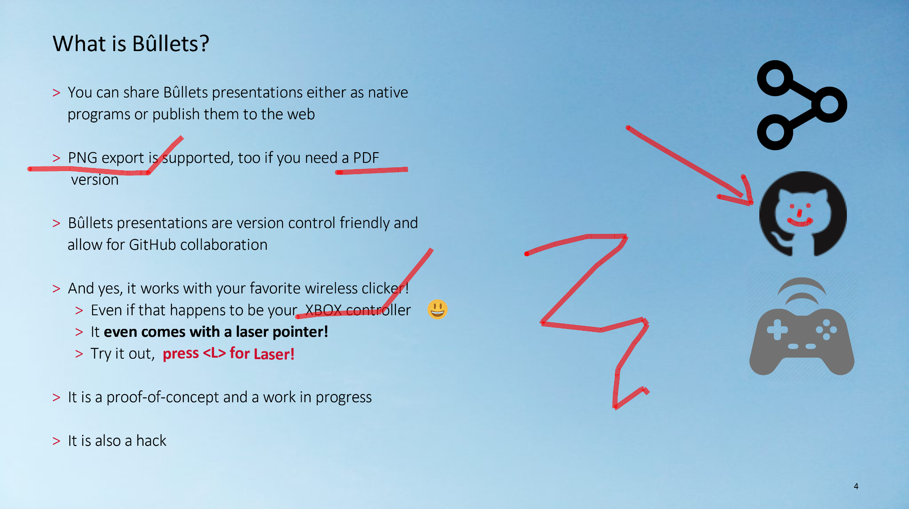
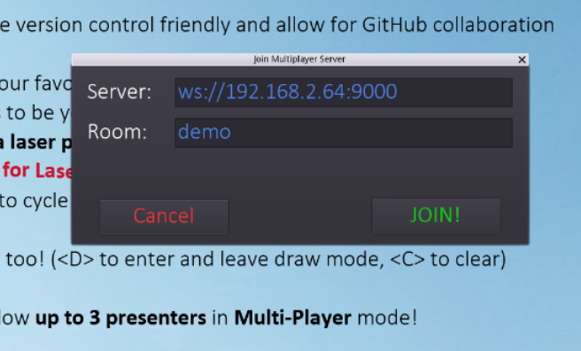
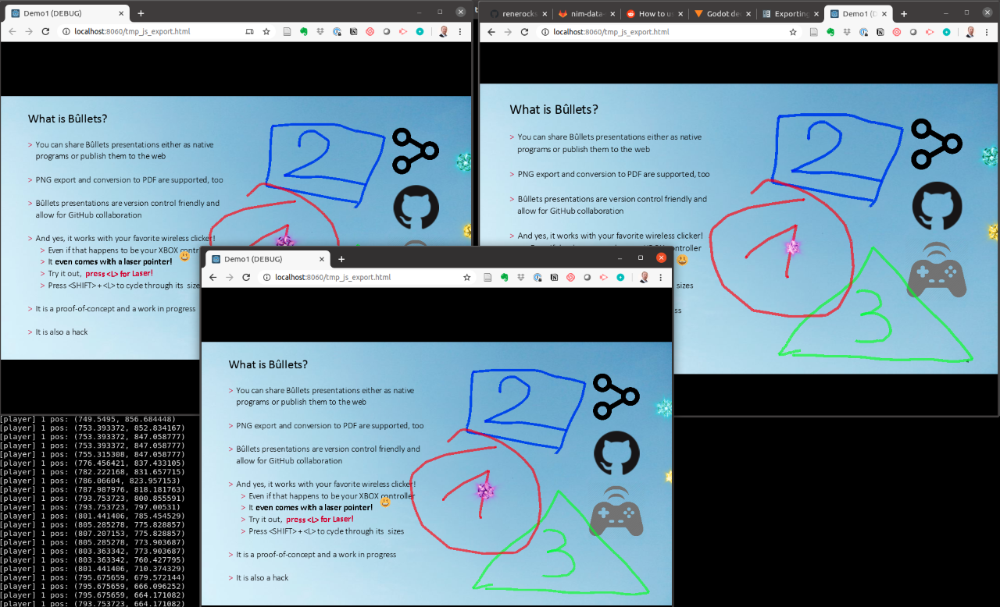
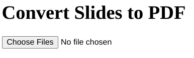

# Bûllets

## Slide Show meets Game Engine



### Check out the [demo presentation](https://renerocksai.github.io/bullets/bullets.html)!

### See how you can start playing with it on [youtube](https://www.youtube.com/watch?v=PSlo6nRRmZM)! 
Also playing: 
- [**Multiplayer Mode**](https://youtu.be/Z10a3eewbVU) - the next innovation in online presentations!
- [PDF export](https://youtu.be/PikFFpMJDkg) - watch a presentation convert itself to PDF and download itself in the browser.

This software is so **fresh**, it's currently in usable alpha!

1. [What is Bûllets?](#what-is-bûllets)
2. [How To](#how-to)  
2.1 [How to create your first presentation](#how-to-create-your-first-presentation)  
2.2 [How to export to PDF](#how-to-export-to-pdf)  
2.3 [How to run your own multiplayer-server](#how-to-run-your-own-multiplayer-server)

## What is Bûllets? 

- Bûllets is a slide show software powered by the 
    **Godot game engine**

- It helps you create beautiful presentations on all 
    platforms (Windows, Mac, Linux, and the web) that are 100% 
    self-contained  and will look and feel the same on all 
    platforms

- Using plain text with optional easy markup for 
    content makes slide creation a breeze
    - this is how you enter bullet lists
    - 
    - and to the right you see how you can customize the appearance of typical slide elements like title, page numbers, etc.
    - 
- If you know how to code, you can create the most 
    complex, interactive animations, with sound effects -
    or even embed a full game into your slides.
    - 

- You can share Bûllets presentations either as native 
    programs or publish them to the web
    - Like this [first demo](https://renerocksai.github.io/bullets/bullets.html)!

- PDF export is supported, too
    - Web-exported Bûllets can directly create PDF and download presentations from your slides - right in the browser!
        - All you have to do is: press `<P>`
    - Native Bûllets executables can create PNG images from your slides
        - a small browser tool converts the PNG slides to PDF
        - the conversion happens locally in the browser, no upload is required

- Bûllets presentations are version control friendly and 
    allow for GitHub collaboration

- And yes, it works with your favorite wireless clicker!
	- Even if that happens to be your  XBOX controller :sunglasses:
	- It **even comes with a laser pointer!**
	    - 
	- You can **draw on slides**, too!
	    - 
- In **Multiplayer mode** up to 3 presenters can control the same presentation simultaneously!
	- each presenter gets a different laserpointer color
	- each presenter gets a different drawing color
	- you only need to agree on a "room" when joining:
	    - 
	- and a running [bullets-server](https://github.com/renerocksai/bullets-server) to connect to. 
	    - then all up to 3 of you can control the presentation, interact with it, point your lasers, and draw in your window -- and all updates get instantly relayed to all other players in the same room :sunglasses:!
	    - see [How to run your own multiplayer-server](#how-to-run-your-own-multiplayer-server) for details on running your own!
	- 
	- Check it out on [youtube](https://youtu.be/Z10a3eewbVU)

- Bûllets is a proof-of-concept and a work in progress

- It is also a hack

## How to...

### How to create your first presentation
It only takes 15 minutes, including downloading Godot. Watch it on [youtube](https://www.youtube.com/watch?v=PSlo6nRRmZM)!

### How to export to PDF

#### The easy way: from the web exoport
- Run your presentation in the browser, after a web export
- Go to the first slide
- Press `<P>`
- You're done!
    - Bûllets will iterate over all slides and create PDF pages in the background
    - At the last slide, the PDF download will start automatically
    
Note: The conversion will happen purely in your browser via JavaScript. Your slides will not be uploaded to any server for conversion.

See how that works on [youtube](https://youtu.be/PikFFpMJDkg) (1:20)

#### The native way
- Run your presentation from the Godot Editor (not the web version).
- Press the `<P>` key
- The slideshow will now iterate over all slides and create a .PNG image for each
- Locate `pdfstuff/browser/index.hml` from your Bûllets folder and double-click it to open it in your browser
    - This is what it will look like:
    - 
- Click the _Choose Files_ button
- Select all the generated PNG slides
- Click _Open_
- Done, the PDF will be "downloaded" as `result.pdf` instantly

Note: The conversion will happen purely in your browser via JavaScript. Your slides will not be uploaded to any server for conversion.

### How to run your own multiplayer server

Running your own multiplayer server is easy. Unless you're playing with Docker, you need a linux system.

You only ever need to run 1 server - and can use it for all your presentations! It is up to you and your users to make sure that you choose unique room names for your presentations when connecting to the server. To not let things get out of hand, I hardcoded a limit of 30 simultaneous connections into the server. You can change that to your liking, the server hardly consumes any CPU or memory resources anyway.

- Go to [the bullets-server project page](https://github.com/renerocksai/bullets-server)
- Clone or download the project
- Download the **server** edition of Godot:
    - go to [godotengine.org](https://godotengine.org)
    - click on 'Downloads'
    - click on 'download repository'
    - go to the latest release, e.g. 3.2.2
    - download [Godot_v3.3.3-stable_linux_server.64.zip](https://downloads.tuxfamily.org/godotengine/3.2.2/Godot_v3.2.2-stable_linux_server.64.zip), for the 3.2.2 version (your version may differ)
    - unzip the server
    - put it somewhere where you can start it conveniently (e.g. $HOME/bin)

Just run the Godot server in your multiplayer server directory. It will start listening on port 9000 - so make sure your port forwardings and firewalls are OK with that.

Example:

```bash
$ cd bullets-server
$ Godot_v3.2.2-stable_linux_headless.64 --port=9000
```

The commandline argument `--port=xxxx` allows you to specify a different port; 9000 is the default in which case the argument can be omitted.


#### A note on HTTPS
If you're hosting your presentations on a site with HTTPS enabled, which you should, browsers will not allow your presentations to contact a multiplayer server that uses unencrypted websocket connections. So in that case you need to set up the multiplayer server to use encrypted websockets. For that you need SSL certificates and keys!

**Note**: Luckily enough, **any** secure server will do. This is super handy if you host your presentations on GitHub pages. You can host them there but run the multiplayer server on some other server where you have access to the SSL certificate. Check out Google cloud compute, AWS, etc. They all have free contingents for running super small linux server VMs.

So, you only ever need to run 1 server - and can use it for all your presentations! It is up to you and your users to make sure that you choose unique room names for your presentations when connecting to the server. To not let things get out of hand, I hardcoded a limit of 30 simultaneous connections into the server. You can change that to your liking, the server hardly consumes any CPU or memory resources anyway.

If you're using Letsencrypt, the files `privkey.pem` and `fullchain.pem` are what you need. They're typically found at `/etc/letsencrypt/live/my-site`, where `my-site` stands for the name of your site. Rename the 2 files so they have the `.key` and `.crt` extension or else the Godot server will not know how to process them.

Once you have your key and certificate files handy, you start the multiplayer server like this, in your multiplayer server directory:

```bash
$ cd bullets-server
$ Godot_v3.2.2-stable_linux_headless.64 --keyfile=privkey.key --certfile=fullchain.crt
```

The above line also shows the defaults for keyfile and certfile. If the files cannot be found, a warning will be printed to the console and SSL support will not be available. The commandline argument `--port=xxxx` allows you to specify a different port; 9000 is the default in which case the argument can be omitted.


**Note for clients**: Your server connection string changes from **`ws://`**`my-server:9000` to **`wss://`**`my-server:9000`. Note the extra `s` in `wss://`.
